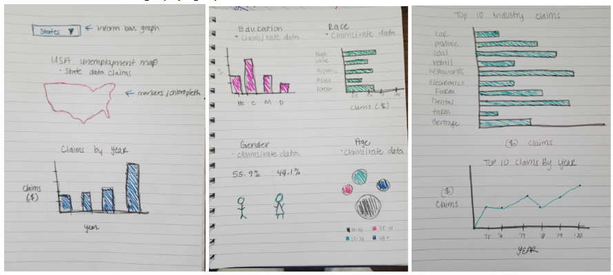

# US Unemployment Dashboard

## Team
Zen Acar, Gina Cameras, Harini Rao, Carlos Santillan

## Topic
Our team will create a dashboard to visualize US unemployment trends to understand how COVID has affected unemployment for the following dimensions
* State
* Age
* Gender
* Industry

## Datasets
* State level unemployment data (2015 - Present)
https://oui.doleta.gov/unemploy/claims.asp (weekly | # of claims)
* Industry level unemployment data
https://download.bls.gov/pub/time.series/ce/ (monthly | number of people unemployed)
* Demographic level unemployment data
https://download.bls.gov/pub/time.series/ln/ (monthly | number of people unemployed)

## Inspiring Visualizations/links
* https://coronavirus-resources.esri.com/datasets/esribizteam::us-weekly-unemployment-data
* https://coronavirus-resources.esri.com/datasets/esribizteam::us-state-level-unemployment-insurance-weekly-claims?geometry=-178.367%2C26.838%2C-11.111%2C50.467
* https://kystats.ky.gov/Reports/Tableau/CUU_2020

## Sketch of Final Design (3-pages)

## GitHub Repository
https://github.com/csantill/Project_2-DataVizards

